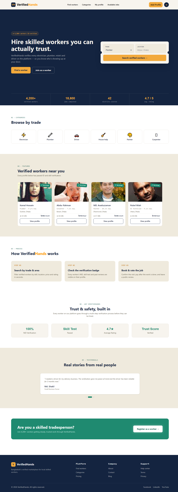
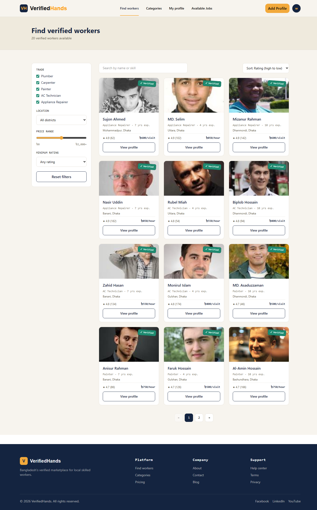
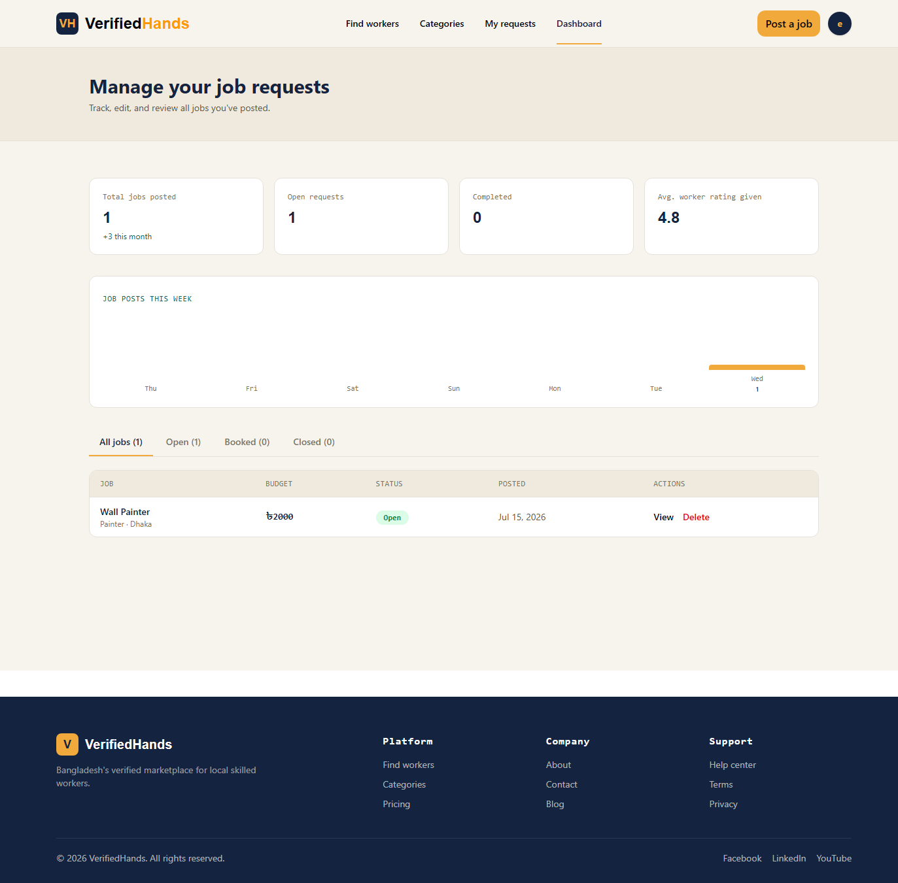

<div align="center">

# 🔧 VerifiedHands

**A verified local skilled-worker marketplace for Bangladesh**

Hire electricians, plumbers, drivers, and other blue-collar professionals you can actually trust — every worker is ID and skill verified.

# VerifiedHands - Frontend


[Live Demo](#) 

</div>

---

## 📌 The Problem

In Bangladesh, hiring a local tradesperson — an electrician, plumber, or driver — almost always relies on informal word-of-mouth. There is no standard way to verify identity, confirm skill level, or check a track record before letting someone into your home. **VerifiedHands** solves this by giving every worker a verified profile (NID + skill check) and giving employers a searchable, filterable, ratings-backed marketplace to hire from with confidence.

---

## ✨ Key Features

- 🔐 **Role-based authentication** — separate Employer and Worker experiences, powered by Better-Auth with JWT session verification
- ✅ **Verified worker profiles** — NID and skill-test verification badge on every listing
- 🔍 **Advanced search & filtering** — filter by trade, location, price range, and minimum rating; sort by rating, price, or recency
- 📄 **Public worker profile pages** — bio, skills, availability, rate, and real customer reviews
- 📝 **Protected dashboards**
  - Workers can create/manage their profile and view incoming job requests
  - Employers can post job requests and manage/track them (open, booked, closed)
- 📊 **Dashboard analytics** — job-posting trends visualized with Recharts
- 💀 **Skeleton loading states** for a polished, production-grade UX
- 📱 **Fully responsive** — mobile, tablet, and desktop layouts throughout
- 🎨 **Custom design system** — consistent typography, spacing, and a signature "Verified" stamp motif across the product

---

## 🛠️ Tech Stack

| Layer | Technology |
|---|---|
| **Frontend** | React (Vite), TypeScript, Tailwind CSS, Recharts |
| **Backend** | Node.js, Express.js, TypeScript |
| **Database** | MongoDB with Mongoose |
| **Authentication** | Better-Auth (JWT-based sessions, role-based access control) |
| **Deployment** | Vercel (frontend ) | Redis (Backend)

---

## 🏗️ Architecture

```
verifiedhands/
├── verifiedhands-frontend/     # React + TypeScript client
│   ├── src/
│   │   ├── components/          # Navbar, Footer, WorkerCard, etc.
│   │   ├── pages/                # Home, Workers, WorkerDetails, Dashboard...
│   │   ├── lib/                  # auth-client.ts, api.ts
│   │   └── types/                # Shared TypeScript interfaces
│   └── ...
└── verifiedhands-backend/      # Express + TypeScript API
    ├── src/
    │   ├── models/                # User, WorkerProfile, JobRequest, Review
    │   ├── routes/                 # auth, worker, job routes
    │   ├── controllers/
    │   ├── middleware/             # JWT auth guard
    │   └── config/                 # DB connection, Better-Auth config
    └── ...
```

---

## 🚀 Getting Started

### Prerequisites
- Node.js v18+
- MongoDB (local or Atlas)

### Backend Setup

```bash
cd verifiedhands-backend
npm install
```

Create a `.env` file:
```env
MONGODB_URI=your_mongodb_connection_string
BETTER_AUTH_SECRET=your_secret_key
BASE_URL=http://localhost:5000
FRONTEND_URL=http://localhost:5173
PORT=5000
```

```bash
npm run dev
```

### Frontend Setup

```bash
cd verifiedhands-frontend
npm install
```

Create a `.env` file:
```env
VITE_API_URL=http://localhost:5000
```

```bash
npm run dev
```

---

## 🔑 Demo Credentials

| Role | Email | Password |
|---|---|---|
| Employer | `demo@employer.com` | `demo123456` |
| Worker | `demo@worker.com` | `demo123456` |

*(Use the "Demo Login" button on the login page to auto-fill these credentials.)*

---


## 🗺️ Pages

| Page | Route | Access |
|---|---|---|
| Home | `/` | Public |
| Find Workers | `/workers` | Public |
| Worker Details | `/workers/:id` | Public |
| Login / Register | `/login`, `/register` | Public |
| Add Worker Profile | `/profile/add` | Worker only |
| Post a Job | `/jobs/post` | Employer only |
| Manage Dashboard | `/dashboard/manage` | Authenticated (role-based view) |
| About / Contact | `/about`, `/contact` | Public |

---

## 📸 Screenshots

> Home : 
> Find Workers: 
> Dashboard: 

---

## 🧭 Roadmap

- [ ] Admin role with platform-wide analytics
- [ ] In-app messaging between employer and worker
- [ ] Payment integration
- [ ] SMS/email notifications for job requests

---

## 👤 Author

**Hosenuzzaman**
Full-Stack Developer building projects with the MERN stack and TypeScript.

- GitHub: [https://github.com/shawon2911]
- LinkedIn: [https://www.linkedin.com/in/hosenuzzaman]

---
